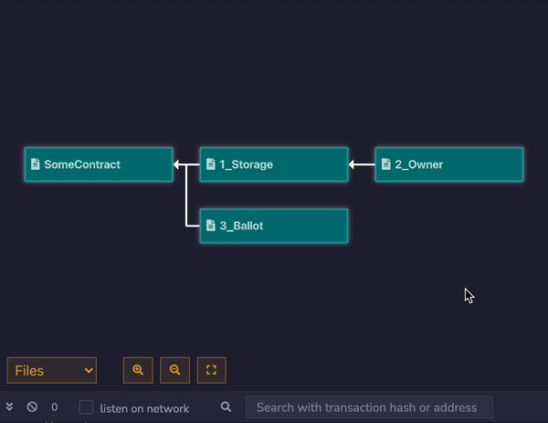

# Viblex (Visual Blockchain Explorer)
A tool for graphical analysis of blockchain components.

Features:
* Contract Inheritance Graph ✅
* Solidity File Import Graph ✅
* Transaction Sequence Graph 🏗️
* Transaction View 🏗️
* Block View 🏗️
* Interaction Module 🏗️

**Viblex hasn't been released yet. It will be relasead as [remix plugin](https://remix-project.org/) and standalone web app.**