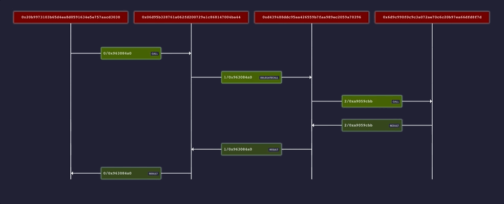

# Viblex (Visual Blockchain Explorer)
A tool for graphical analysis of blockchain components.

## Features
* Contract Inheritance Graph ✅
* Solidity File Import Graph ✅
* Transaction Sequence Graph ✅
* Transaction View ✅
* Block View ✅
* Interaction Module 🏗️

### Block and Transaction View

### Contract Inheritance and Solidity File Import Graph 

### Transaction Sequence Graph

**Viblex hasn't been released yet. It will be relasead as [remix plugin](https://remix-project.org/) and standalone web app.**